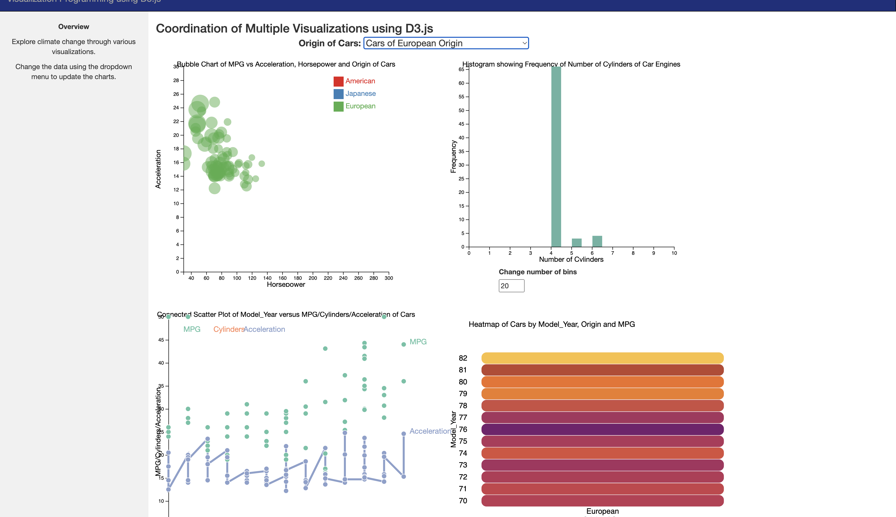
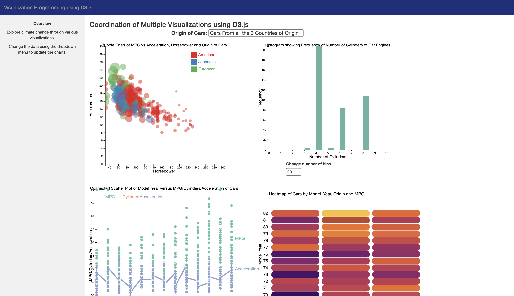
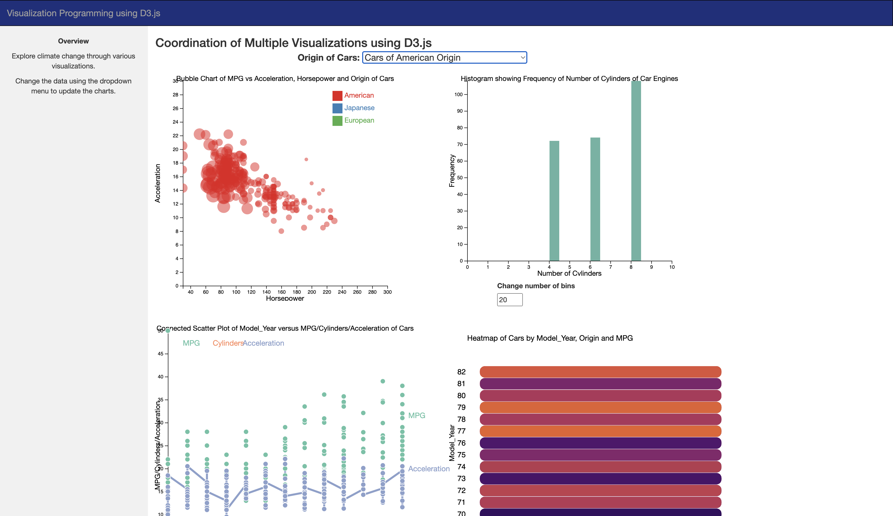
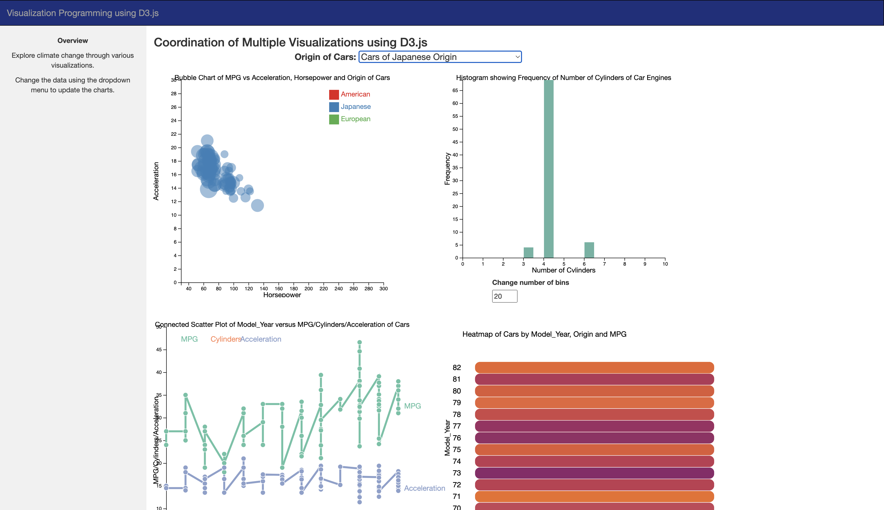

# Cars-Dashboard-D3-js

## Introduction

This repo contains the code for a dashboard of Multiple Coordinated and Interactive Visualizations in D3.js. The dataset used for this project is the a1-cars.csv dataset. The Visualization charts implemented are:

1. Bubble Chart
2. Histogram
3. Connected Scatter Plot
4. Heat map

